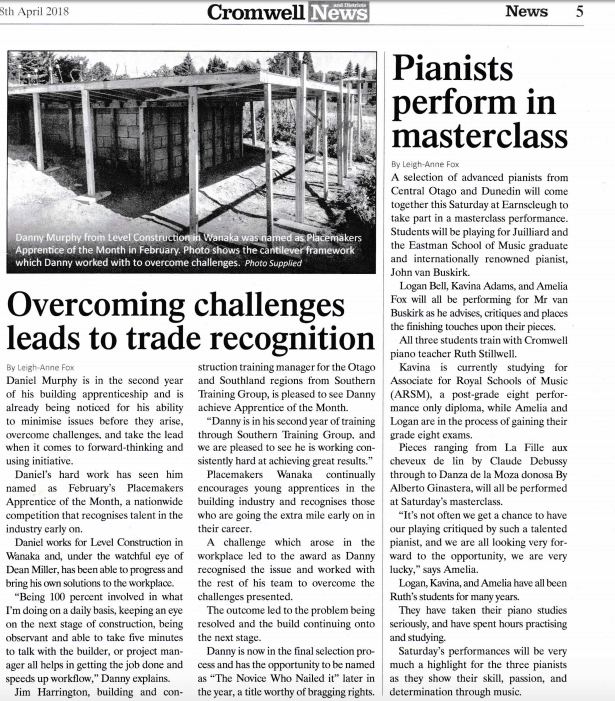

## Education

* Qualified Builder / Carpenter NZC Level 4.

* BEng (Hons) Sustainable Energy Engineering at the Waterford Institute of Technology.

* 7 ECTS credits in Sustainability Studies at the Vienna Summer School at the University of Natural Resources and Life Sciences.

## Honors & Awards

* Apprentice of the Year Award, Placemakers, New Zealand (2018).

* 2x Apprentice of the Month Award, Placemakers, New Zealand (2018).

* AIB Engineering Student of the Year 2015, School of Engineering Waterford Institute of Technology (April 2015).

* Scholarship Recipient to Green Building Solutions 2015, University of Vienna - OeAD Passivhaus (April 2015).

* Passive House Design Charrette Winners, Passive House Authority of Ireland (November 2014).

