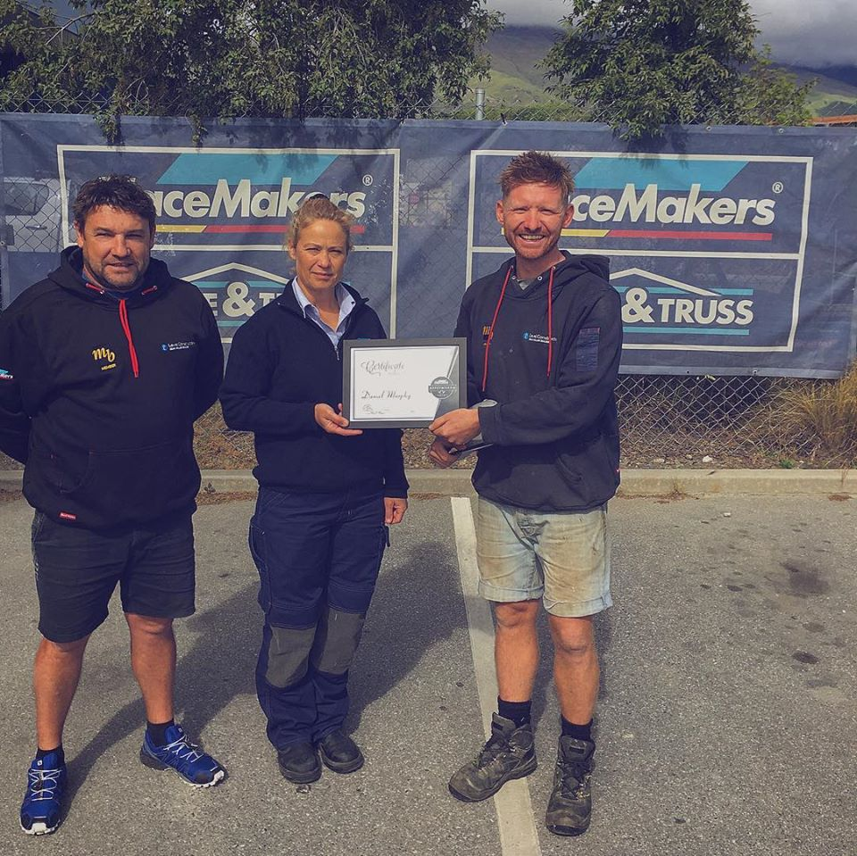

## Professional

I am a qualified sustainability engineer (Level X of Y) and qualified carpenter (Leair quality, vel A of B) with a particular interest and passion in [Passive Housing (Passivhaus)](https://en.wikipedia.org/wiki/Passive_house) and the efficiency of heating systems and air quality. 

Since October 2016 I have been employed by [Level Construction](https://levelconstruction.co.nz/) in New Zealand.

