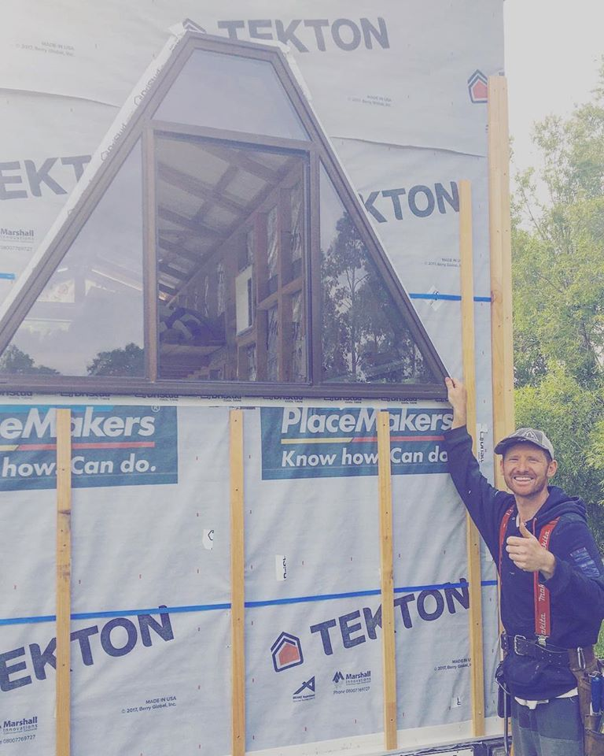
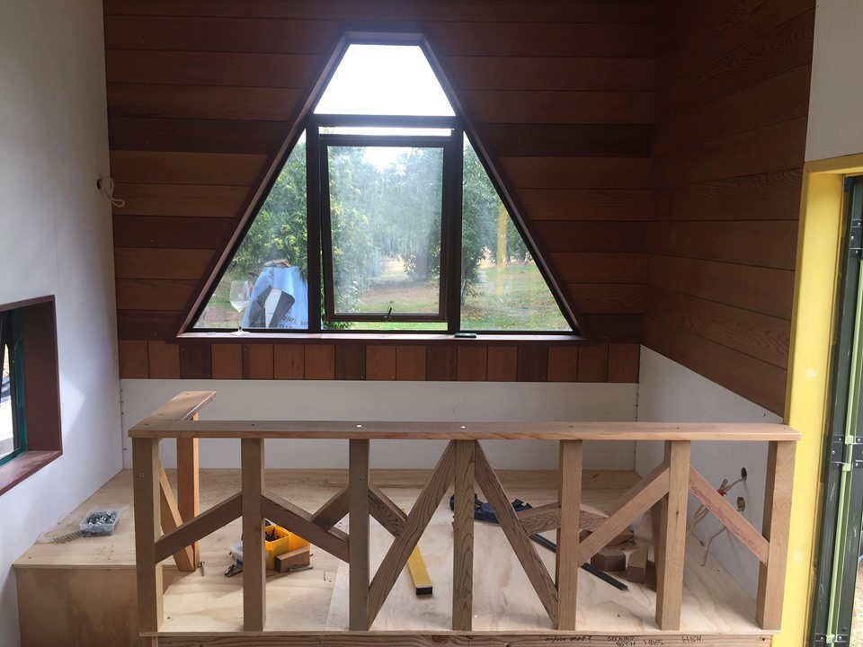
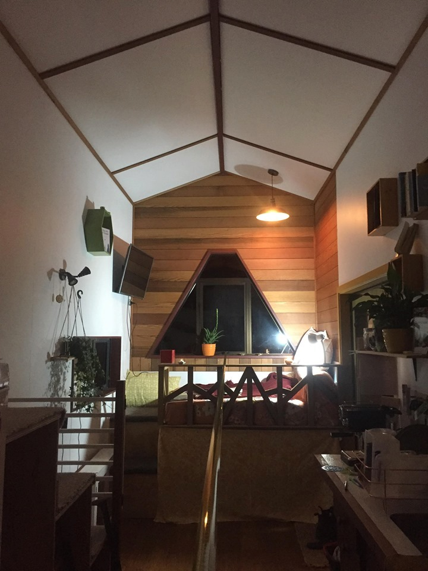
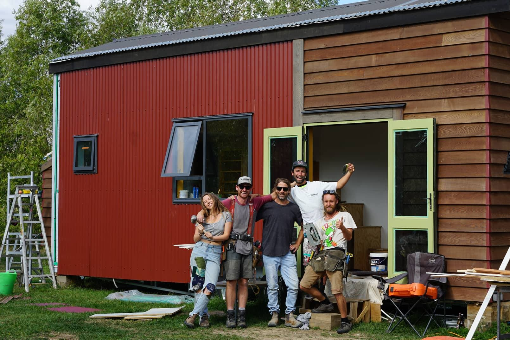
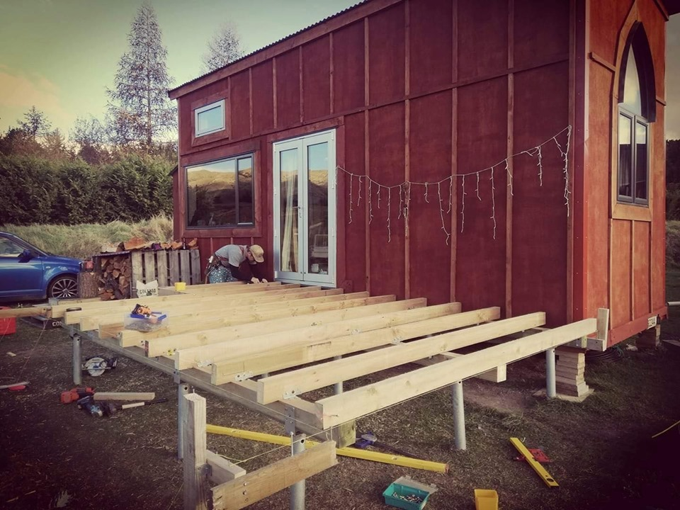

While living in Wanaka, NZ I designed, budgeted, and built my own tiny house. The project aimed to reuse as much material as possible; including those that were destined for the skip or from unwanted house holds.

